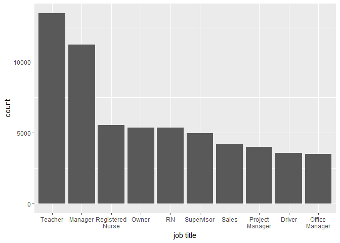
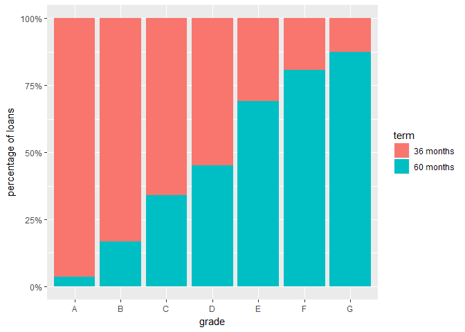
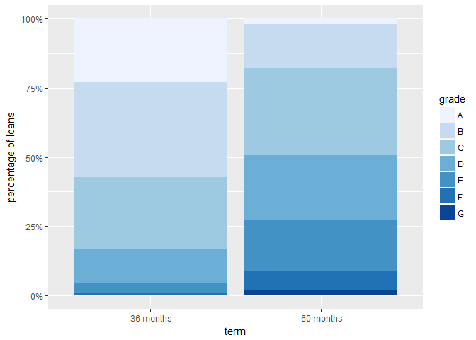
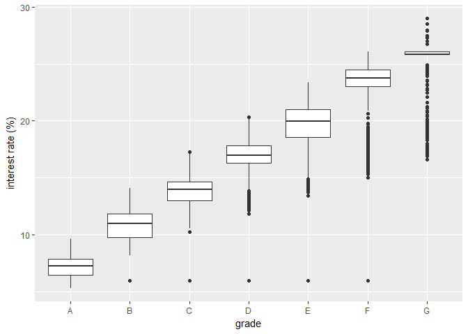

Lending Club Exploratory Data Analysis
========================================================

Lending Club is an online lending service that allows borrowers to connect
with investors through a marketplace in a service known as peer-to-peer lending.
It's a form of lending that's known to often be cheaper than banks. The dataset
that will be explored in this exploratory data analysis investigation is one
that contains loan data for almost 900 000 loans handled by Lending Club between
2007 and 2015. It includes observations on over 70 variables including loan
description, interest rate, loan status, and many more. 

Through this analysis, we hope to gain a better understanding of:

1. What types of loans Lending Club are making?
2. What types of people take out these loans?
3. How does Lending Club create loans that are favourable for investors?


***

We notice right off the bat that this dataset is very large. We cannot possibly
examine every variable in this analysis. Returning to our primary aims, we can
narrow down the list of variables to examine.

It was also discovered that several key variables listed in the dataset
documentation are missing from the actual data. Most importantly, no FICO credit
information is available for any of the loans, taking away a key factor in 
the money lending process.

With this in mind, 15 variables have been selected from the larger dataset to
base this investigation upon. They have been placed into a separate datafram for
ease of use.


```r
working <- select(loan, addr_state, annual_inc, purpose, dti, grade, sub_grade,
                  issue_d, emp_title, home_ownership, loan_amnt, member_id,
                  term, int_rate, installment, delinq_2yrs, loan_status)

working$grade <- factor(working$grade, 
                        c("A", "B", "C", "D", "E", "F", "G"), ordered=TRUE)

str(working)
```

```
## 'data.frame':	887379 obs. of  16 variables:
##  $ addr_state    : Factor w/ 51 levels "AK","AL","AR",..: 4 11 15 5 38 4 28 5 5 44 ...
##  $ annual_inc    : num  24000 30000 12252 49200 80000 ...
##  $ purpose       : Factor w/ 14 levels "car","credit_card",..: 2 1 12 10 10 14 3 1 12 10 ...
##  $ dti           : num  27.65 1 8.72 20 17.94 ...
##  $ grade         : Ord.factor w/ 7 levels "A"<"B"<"C"<"D"<..: 2 3 3 3 2 1 3 5 6 2 ...
##  $ sub_grade     : Factor w/ 35 levels "A1","A2","A3",..: 7 14 15 11 10 4 15 21 27 10 ...
##  $ issue_d       : Factor w/ 103 levels "Apr-2008","Apr-2009",..: 22 22 22 22 22 22 22 22 22 22 ...
##  $ emp_title     : Factor w/ 299273 levels "","'Property Manager",..: 1 224800 1 9376 282199 285977 246848 171062 1 256905 ...
##  $ home_ownership: Factor w/ 6 levels "ANY","MORTGAGE",..: 6 6 6 6 6 6 6 6 5 6 ...
##  $ loan_amnt     : num  5000 2500 2400 10000 3000 ...
##  $ member_id     : int  1296599 1314167 1313524 1277178 1311748 1311441 1304742 1288686 1306957 1306721 ...
##  $ term          : Factor w/ 2 levels " 36 months"," 60 months": 1 2 1 1 2 1 2 1 2 2 ...
##  $ int_rate      : num  10.6 15.3 16 13.5 12.7 ...
##  $ installment   : num  162.9 59.8 84.3 339.3 67.8 ...
##  $ delinq_2yrs   : num  0 0 0 0 0 0 0 0 0 0 ...
##  $ loan_status   : Factor w/ 10 levels "Charged Off",..: 6 1 6 6 2 6 2 6 1 1 ...
```

# Univariate Plots and Analysis

We will start by examining the number of loans given over the duration of the
data recorded in the dataset.

<!-- --><!-- -->

The number of loans given out increases steadily as the years pass. Looking at 
the second plot with a logarithmic y-axis, we can see this growth as an almost 
linear increase, indicating the number of loans made through Lending Club is 
increasing exponentially. We can also see that the growth is not constant. There
are many months were there are large spikes and other where there are large dips.
To see if there is any pattern in these spikes, we will look at the numbers 
behind the visualization.


```
## [1] Yearly totals:
```

```
## date_sorted$issue_year
##   2007   2008   2009   2010   2011   2012   2013   2014   2015 
##    603   2393   5281  12537  21721  53367 134755 235628 421094
```

```
## [1] Monthly averages:
```

```
## date_sorted$issue_month
##       Jan       Feb       Mar       Apr       May       Jun       Jul 
##  7853.125  6468.500  7012.750  8776.750  8491.125  7097.111 10611.000 
##       Aug       Sep       Oct       Nov       Dec 
##  8502.444  6910.444 12441.222  9786.778  8935.556
```

As expected, the number of loans made is increasing rapidly throughout the
years. In the 8 years between 2007 and 2015, the number of loans made through
Lending Club increased by almost 700 times.

Now the monthly average figures is where it gets interesting. General experience
would tell us that most people would probably take out loans most often around
the holiday season when many big purchases are made. However, there doesn't
appear to be any real, explainable trend in the monthly average data with the
two highest monthly averages occurring in October and July and the lowest in 
February and September.

***

Now that we know how many loans Lending Club are making, and when they are made,
we should learn about what *type* of loans they are facilitating. All loans made
are graded for stability and risk by lenders using factors like credit history, 
collateral, likelihood of repayment, etc. We can see the distribution of the
grades of the loans below.

<!-- --><!-- -->

As we can see, the distribution for both grade and subgrade is right-skewed
with most of the loans being of grade B or C. Looking at the more detailed 
subgrade classifications, we see the same general shape. Very high grade loans 
(A1, A2, A3) are not quite so common and the tail also tapers off quickly
with very few loans of grade F and G. This shows that most investors are more
likely to take on safer loans rather than make perhaps more money with more
risky options.

With this in mind, what is the risk like to investors? How many of Lending Clubs
loans are unsuccessful?

<!-- --><!-- -->

```
##                                         Charged Off 
##                                               45248 
##                                             Current 
##                                              601779 
##                                             Default 
##                                                1219 
## Does not meet the credit policy. Status:Charged Off 
##                                                 761 
##  Does not meet the credit policy. Status:Fully Paid 
##                                                1988 
##                                          Fully Paid 
##                                              207723 
##                                     In Grace Period 
##                                                6253 
##                                              Issued 
##                                                8460 
##                                   Late (16-30 days) 
##                                                2357 
##                                  Late (31-120 days) 
##                                               11591
```

The distribution shows that the vast majority (70%) of Lending Club loans are
currently in progress and up to date on all payments. The numbers then drop off
steeply leading into a very long tail that has been adjusted using a log(10) 
y-axis in the second plot. 

It would appear that most loans done through Lending Club are fairly safe for
investors. Out of 285 000 completed loans, 80% of them have been fully paid off
with only 0.4% of loans defaulting (120+ days past due) and around 16% charged
off (150+ days past due and with little expectation of repayment).

Additionally, to further understand the investment potential on Lending Club
loans, we should look at the potential returns for the investors. Lending Club
assigns an interest rate to each loan based on loan grade and borrower credit
history.

<!-- -->

```
##    Min. 1st Qu.  Median    Mean 3rd Qu.    Max. 
##    5.32    9.99   12.99   13.25   16.20   28.99
```

The red line represents the median value and the blue line the mean. With the
mean, median, and mode all centered around the 13% mark, the distribution looks 
almost normal between 5% and 20% with a sharp fall-off after 20%. In fact, only 
7% of loans had interest rates above 20%.

***

Now let's look at the actual amount of money loaned out through Lending Club
services.

<!-- -->

```
##    Min. 1st Qu.  Median    Mean 3rd Qu.    Max. 
##     500    8000   13000   14760   20000   35000
```

We notice from this plot the distinct peaks at "nice" amounts like \$10 000, 
\$15 000, and \$20 000, which is to be expected. The red line in the above plot 
indicates the median of \$13 000 and the blue line the mean of \$14 760. This 
indicates an overall right-skewed distribution with a larger number of loans
smaller than the mean rather than larger. We can see the distribution tapering 
into the higher values with, however, another peak at what appears to be a hard 
cap on maximum loans allowed to be given out of \$35 000.

With these loan amounts in mind, we will now examine the annual income of loan
applicants.

<!-- --><!-- -->

```
##    Min. 1st Qu.  Median    Mean 3rd Qu.    Max.    NA's 
##       0   45000   65000   75030   90000 9500000       4
```

Once again, the red line represents the median and the blue, the mean. 
As we can see from these plots, the distribution for the annual income is right-
skewed with a long tail and extreme outliers (a maximum value of \$9 500 000).
Transformed with a log(10) x-axis, the distribution appears to be somewhat
normal. This means that there appear to be individuals with very high annual
incomes (into the high 6-figures and beyond) that are applying for relatively
small loans (up to a maximum of \$35 000). We should now look at who exactly the
people taking out these loans are.

The variable that would best tell us this is *emp_title*, which 
stores the self-declared job title of the applicant at the time of the loan 
application. However, according to the documentation, this variable had its 
purpose changed part-way through the data in the dataset. For entries up until 
09/23/2013, this variable didn't record the job title but the company name of 
the applicant's employer. Therefore, for the sake of consistency for this plot, 
only entries after the change are considered. This reduces the size of our
sample by more than 75%.


```r
# Select only data from after September 2013
after_sep_2013 <- subset(working, !is.na(emp_title)) %>%
  select(emp_title, issue_month, issue_year) %>%
  filter((issue_year > 2013) | (issue_year == 2013 & 
                                (issue_month %in% c("Oct", "Nov", "Dec")))) %>%
  group_by(emp_title) %>%
  summarise(n = n()) %>%
  arrange(desc(n))
```

<!-- -->

From this chart it appears that teachers and managers are by far the most common
applicants for loans from Lending Club. There doesn't seem to be any real 
correlation or similarity between these 10 professions. There seems to be more 
management and leadership-type people in these categories but the remaining 
professions don't seem to share much, if anything, in common. There isn't much 
to indicate what types of people are the most likely to take out loans. This may 
be due to the earlier discussed discrepancy and smaller sample size, but we 
should look at how the applicants used their loans to see if there isn't another
factor at play.

<!-- -->

It would seem that the vast majority of loan applicants applied for the purpose 
of debt consolidation, with a smaller, but still significant number for credit 
card debts. Nothing here is really out of the ordinary or unexpected. The three
most common purposes are also the same ones advertised right on the front page
of Lending Club's website and are probably the most common sources of debt in
the US.

# Multivariate Plots and Analysis

While looking at the variables in the dataset individually has given us
important insights into the data, we can't really go about understanding what
the data can really tell us without looking at variables in relation to each
other.

We'll start by examining the geography of borrowers. (It's expected that there
won't be much learned about the data through this, but I wanted a chance to
explore the mapping packages offered in R.)

<!-- --><!-- -->

It seems from this map that the highest loan amounts come from the states of
California, New York, and Texas. This is to be expected as these are also the
three most populous US states. After adjusting the map to show loan amounts
per person, there appears to be no real relationship between states and Lending
Club usage.

***

As a public company with shareholders to please, one of Lending Club's primary 
objectives is to be profitable. Part of this revolves around creating the most
favourable conditions for their investors to make returns. In this part of the 
investigation, we would like to determine how Lending Club assesses and sets 
the conditions of a loan (interest rate, grade, term, approved loan
amount, etc.).

We start by noting that Lending Club loans are offered in two different lengths
of terms, 36 months or 60 months. Let's examine these two types of loans
and how they differ.

<!-- --><!-- -->

We see immediately that loans with 60-month terms have on average almost 4% 
higher interest than their shorter term counterparts. Continuing to plot versus
term, we find also that the longer terms are associated with significantly 
larger loan amounts as well. The median loan amount for 60 months is almost
double the amount taken in 36-month loans.

Let's look next at the grade classification of these loans. How does Lending Club
rate the risk of loans of differing lengths? To do this, we need to create a 
stacked bar plot showing the proportion of loans of each grade that are of each 
loan length. We start by creating a function that will calculate the proportion
that each term-length of loan takes up in each grade. This function can then be 
used later on to create other stacked proportion bars.


```r
# Function to determine percentage breakdowns of var1 within each
# value of var2

percent_breakdown <- function(data, var1, var2) {
  
  sum_by <- data %>%
    select_(var1, var2) %>%
    group_by_(var2, var1) %>%
    summarise(count = n())
  
  count_by <- by(sum_by$count, sum_by[[var2]], sum)

  count_by<- sapply(count_by, I)

  count_by <- data.frame(levels(sum_by[[var2]]), count_by)

  colnames(count_by) <- c(var2, "total")

  breakdown <- merge(sum_by, count_by, by = var2)
  breakdown$percentage <- breakdown$count / breakdown$total
  
  return(breakdown)
}
```

With the percentage breakdowns calculated, we can now plot.

<!-- -->

This plot makes it clear that the lower the grade, the higher the proportion of
loans that are of longer length. The difference is extremely evident with 
only 3.5% of grade A loans having a 60-month term but 87.5% of grade G loans
having the same term.

<!-- -->

Reversing the breakdown and instead plotting the percentage breakdown of each 
length of term by grade reveals similar information. 36-month loans are composed
mostly of grade A, B, and C loans (comprising a total 83%). Moving to 60-month
loans, the number of A and B grade loans drops off sharply (down 67%) while the
proportion of grade D, E, F, and G loans increases.

It is clear that, in general, Lending Club loans with 60-month terms are
classified as riskier with a lower grade. This is likely caused by both the
longer length of the loan and the much higher average value of the longer loans.

Is it really true though? Are 60-month loans more likely than their shorter 
counterparts to default or be charged off?

<!-- -->

From this breakdown, we can see that the longer term loans don't necessary carry 
a higher risk for investors in terms of defaults and charge-offs. There are 
slightly more (around 1.5%) charge-offs for 60-month loans but not significantly.
While there are slightly less fully paid off loans for the longer term, this is
offset by a similarly higher number of currently in-progress and up to date loans.

It would seem that while Lending Club generally rates longer term loans as 
riskier with higher interest rates, from the current outcomes, it doesn't appear
as though 60-month loans are inherently more risky to investors in terms of
proportion of loans that default or are charged off.

***

In addition to the length of the term, let's examine what other factors go into
the determination of a loan's conditions. Let's start by looking at what kind
of factors could affect a particular loan's interest rate.

<!-- --><!-- --><!-- -->

These plots seem to show that none of the three indicators I believed would be 
telling about how interest rates are determined have any relationship with the
interest rate. Both the interest vs. annual income and the interest vs. dti 
(debt-to-income ratio) graphs show a distinct lack of any real relation. With
the interest rates vs. deliquencies figure, we see that while there are much
fewer loans with higher and higher numbers of delinquencies, the same basic 
bands in the interest rates exist between all of the delinquency categories. 

This is an incredibly surprising finding as I believed these three to be among
the most important ways of determining whether or not a loan would be paid back.
What else other than how much someone makes, how much they borrow, and how many
times they've previously failed to repay a loan could indicate the risk of 
a borrower not paying back a loan?

<!-- -->

This plot shows us that the interest rate seems to be directly pegged to the 
grade rating of the loan. There is very little overlap between the ranges of
interest rates for each grade. This suspicion is confirmed by Lending Club's
website which indicates that interest rates are calculated from the loan grade
classification of each loan (https://www.lendingclub.com/foliofn/rateDetail.action).

The same Lending Club site hints at factors that are taken into account in the 
loan classification process. It appears the some of the factors examined earlier
(namely deliquency history and debt-to-income ratio) are taken into account in 
classifying the grade of each loan. With that in mind, perhaps we should look
at those same factors and how they vary between each grade.

<!-- --><!-- --><!-- -->

There does appear to be a 
dip in annual income as the grades lower, however they rise again approaching the
lowest grades (F and G). There is also a slightly higher debt-to-income 
ratio for lower grade loans, however once again, they dip at grades F and G. More
telling however is the loan amount boxplot. Larger loans generally appear to be
given a lower grade, with the median loan amount for a grade G loan being almost
$8000 higher than that of a grade A, B, or C loan.

We once again seem to be at a dead end. Loan amount can't possibly be the only
factor in determining the risk of a loan and the other variables show only 
a slight relationship with loan grade. It would appear that even if these are
the factors taken into account in the loan-making process, they must not play a
significant factor as there is very little relationship to be seen between their
values and the actual risk rating.

What about the actual classification though? How accurate is the grade rating 
at predicting the success rate of the loan?

<!-- -->

It seems pretty apparent that grade is in fact at least somewhat indicative
of a loan's risk. We can see the very steady increase in proportion of loans
charged off as the grade lowers along with a similar increase in the proportion 
of late loans. While we so far haven't identified what exactly goes into Lending
Club's rating of loans, it does appear to do a good job of accurately rating the
risk of loans.

***

Let's turn our attention now away from risk assessment of the loans and onto
what these loans are used for.

<!-- -->

There are a few standout relationships we can draw from this figure. We can see
that the higher grade loans have a higher proportion of credit card loans and
a lower proportion of loans classified under "small business" and "other".

<!-- -->

The most interesting revelation to come out of this plot is that loans given for
the declared purpose of education have a median borrower income almost $25 000 
lower than average. This makes sense as these are likely students, recently
graduated, looking for a low-interest way of consolidating student loans. On the
other hand, we can see that loans made for the purpose of small business and 
home improvement have a slightly above average annual income, one again reflective
of the nature of the purpose of these loans.

# Final Plots and Summary

<!-- -->

The above figure shows the current spread of loan statuses at Lending Club. Most
loans seem to be current and up-to-date on payments, followed by complete and
fully paid loans. Around 1/20 of loans are charged off.

***

<!-- -->

It appears that Lending Club interest rates are assigned based upon the loan
grade classification given to each loan.

***

<!-- -->

Lower grade loans are more commonly charged off or late than higher grade ones.

------

# Reflection

I have discovered a great deal from the initial exploratory data analysis on the
Lending Club dataset. We've looked at the relationships between 15 different 
variables to see what we can learn about Lending Club -- their growth, their
loans, their customers.

We've examined the characteristics of Lending Club's customer base and the 
characterics of the loans they facilitate. We've looked at the factors that 
potentially go into the determination and classification of risk for a loan and
how those factors correlate with a loan's status and chance of repayment.

There are however, many answers left to be uncovered and many questions left to
be asked. The scale of the dataset is so massive that any such analysis can only
focus on a small subset of the available data. Questions that we have been 
unable to answer in theis exploration, such as what factors really go into the
risk assessment and classification of loans, may become evident had more 
variables been considered (such as total number of credit lines, collateral 
amounts, etc.). Perhaps we chose the right ones in this exploration.

Additionally, and importantly, a crucial variable to this investigation was
missing from the dataset. The documentation indicates that there should be a
variable storing the FICO credit score information for each borrower. By all 
indications -- the Lending Club website, how loans are generally given -- this
is perhaps the most important variable in determining the terms of any loan. 
Since we found no significant relationship between any of the main factors in 
determining a loan's risk and the actual assessment of said risk made by
Lending Club, credit score is perhaps the primary assessment factor. Without
this variable, our exploration can never be truly complete.
